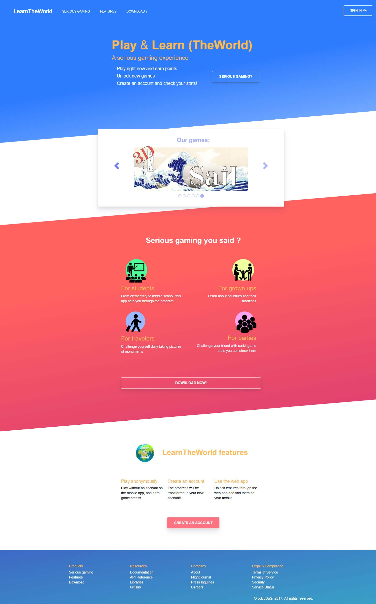

# LearnTheWorld - Vue.js

## DISCLAIMER
**I was only responsible of the "look" of the app.**
The logic has been done by another person (school project).
Thus **I am not responsible** for the messy code quality and architecture
of the project.

## Usage
```
yarn install

yarn run dev

```

## Final look

